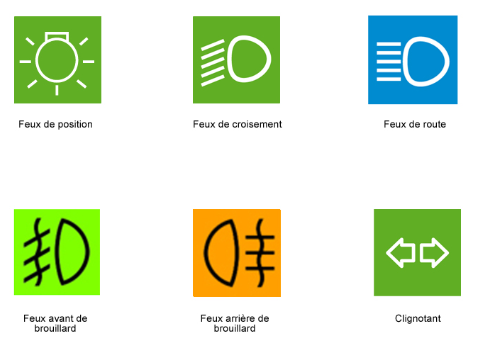
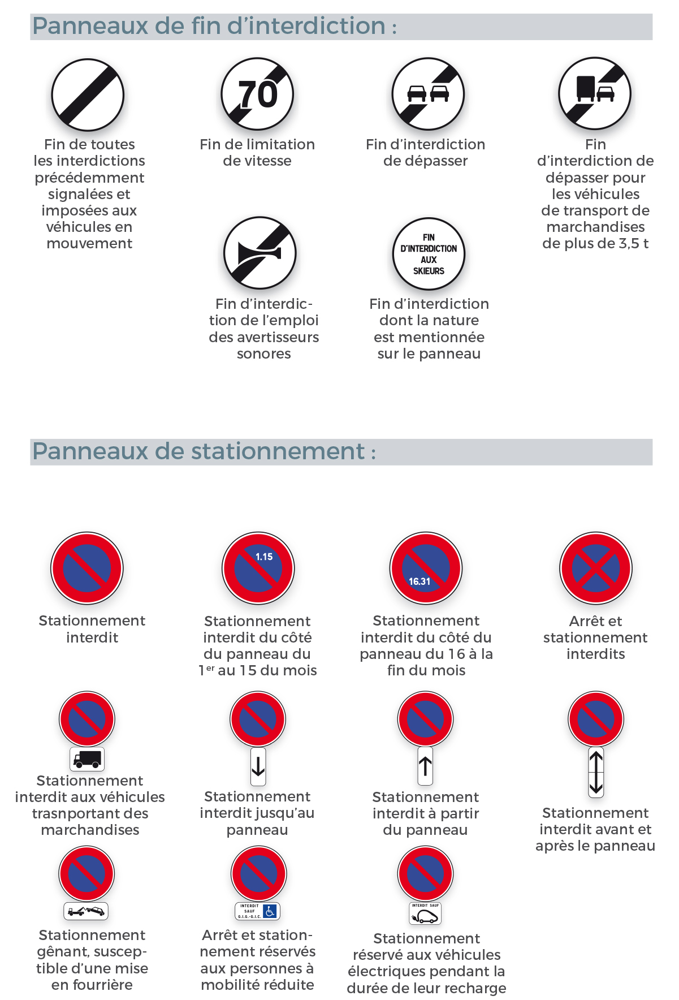

# Code

## Déroulement de l'examen

#### 10 thèmes :
- Entrée et sortie
- Règles et signalisation
- Conducteur / conductrice
- Circulation
- Autres usagers
- Réglementation et accidents
- Réglementation et accidents
- Éléments mécaniques
- Équipements de sécurité
- Éco-conduite

#### 2 formats de visuels vous sont proposés :
- des photos statiques
- des vidéos (4 maximum par série)
#### 4 formats de questions sont proposés :
- une question à 2 réponses
- une question à 3 réponses
- une question à 4 réponses
- une double question à 2 réponses chacune

## Exercice de conduite commentée
#### Ce qu'il faut faire
- Ce que je vois : l'indice utilise qui semble important pour la conduite
- Ce qu'il pourrait se passer
- Ce que je compte faire pour gérer le problème

## Entrée et sortie

#### Vérification extérieures :
- Pneus (gonflement,hernies,crevaison,...)
- Vitres (pare-brise, rétroviseurs, phares, vitres)
- État général du véhicule (chocs, cassage, fuite, ...)
- Situation du véhicule (sortir sans abîmer le véhicule, neige)

#### Vérification intérieures :
- Siège (position, pas encombré)
- Vitesse ne soit pas enclenchée -> point mort
- Tous les passagers ont une ceinture de sécurité
- Rétroviseur intérieur propre
- Intérieur des vitres accessibles et propres

#### Installation au volant :
###### - Pas de vêtements trop larges ou trop épais (X manteau/écharpe)
###### - Chaussures adaptées
###### - Siège
	-> La profondeur du siège (jambes semi-fléchies lors de l'embrayage au max)
	-> La hauteur du siège (yeux au milieu du pare-brise)
	-> L'inclinaison du dossier (bras sur volant semi-fléchies)
	-> La hauteur de l'appui-tête (haut de l'appui-tête au niveau du sommet du crâne)
###### - Volant (hauteur/profondeur)
###### - Rétroviseurs
	-> Rétroviseur intérieur (voir haut de la vitre arrière/une partie des appuie-tête arrières)
	-> Rétroviseur droit (voir la poignée de la portière droite en bas du miroir)
	-> Rétroviseur gauche (voir la poignée de la portière gauche en bas du miroir)

###### - Ceinture
	-> clavicule/hanche droite/hanche gauche
	-> Pas sous l'aisselle
	-> Pas touche au cou
	-> Pas torsadé
	-> Obligatoire femme enceinte (sauf ordonnance)

#### Entrer dans le véhicule :
- Sans gêner un autre usager
- Portière ne heurte pas d'obstacle
- Vérifier l'angle mort
- Ouvrir la porte de la main opposée pour sortir
- Faire sortir les enfants du côté trottoir
- cas de panne -> sortir tout le monde y compris le conducteur

#### Quitter le véhicule :
- Serrer le frein à main, même si la route est bien plane
- Si vous êtes stationné en pente ou en montée 
	-> enclencher une vitesse
	-> tourner les roues de votre voiture contre le trottoir
- Sans gêner un autre usager
- Portière ne heurte pas d'obstacle
- Vérifier l'angle mort
- Ouvrir la porte de la main opposée pour sortir
- Faire sortir les enfants du côté trottoir
- cas de panne -> sortir tout le monde y compris le conducteur
- Vérifier que vous avez bien fermé les portières du véhicule.
- Vérifier si le stationnement est payant -> payer la durée de stationnement estimée.

## Règles et signalisation

#### Signalisation verticale (panneaux, panonceaux, balises et bornes)
###### - Panneaux (Forme/Couleur)
	-> Triangulaire = Danger
	-> Rond = Ordre : Interdiction ou Obligation
	-> Carré = Indication
	-> Rectangulaire = Localisation
	-> Flèche = Direction
	/
	-> Jaune = Temporaire
	-> Rouge = Interdiction
	-> Bleu = Obligation
	


###### Exemples :
```
- Panneau Danger = Triangle + Bordure rouge
	-> Soit un danger certain (virages, feux tricolores)
	-> Soit un danger éventuel (animaux, chutes de pierres)
	-> 150 mètres avant le danger hors agglomération
	-> 50 mètres avant le danger en agglomération
- Panneau Interdiction = Rond + Bordure rouge
	-> Limiter une vitesse/interdire une manœuvre/l'accès d'une route
	-> Interdiction prend effet à l'hauteur du panneau (sauf panonceau de distance)
	-> Interdiction se termine à la prochaine intersection/panneau fin d'interdiction
- Panneau Obligation = Rond + Fond bleu
	-> Directions obligatoires/contournement obligatoire/voie réservée et obligatoire pour un 
	type d'usagers/obligation de port d'équipement
	-> Obligation prend effet à l'hauteur du panneau (sauf panonceau de distance)
	-> Obligation se termine à la prochaine intersection/panneau fin d'obligation
- Panneau Indication = Carré + Fond bleu
	-> Conduite/Indication utiles (Route à sens unique/passe piéton)
- Panneau de localisation
	-> Agglomération (Blanc + contour rouge)
	-> Touristique (Marron)
	-> Lieux-dits (Noir)
- Panneau de direction
	-> Autoroute (Bleu)
	-> Route + Autoroute (Vert avec symbole de l'autoroute)
	-> Nationales/Départementales (Vert) pour ville importante
	-> Nationales/Départementales (Blanc) pour ville normale
	-> Route BIS (Jaune + S/BIS)
```
###### - Balises et bornes :
	-> Guider/Être averti des différentes dangers
	


###### Exemples :
```
-> Balises vertes = verte + 2 lignes blanches
-> Balise de tête d'îlot = Carré bleu flèche blanche diagonale bas
-> Balise de virage = blanc + pointe rouge/blanc + ligne blanche
-> Balise d'obstacle = bleu + ligne blanche torsadé
-> Balise de virage = rectangle bleu + flèche blanche côté
-> Délinéateurs = blanc + ligne noire + point blanc
-> Balise d'intersection = blanc + ligne rouge
```

#### Signalisation horizontale (lignes, les flèches, voies spécialisées et marquages spécifiques)
###### - Lignes
	-> Ligne continue
	Interdit de franchir
	Interdit de chevauchement (sauf dépasser cycliste si bonne visibilité)
  
	-> Ligne de dissuasion
	Dangereux de dépasser mais autorisé pour véhicule lent
	Sur autoroute -> Interdit rabattement tout à gauche
  
	-> Flèches de rabattement
	Bientôt une Ligne continue
	Avoir fini son dépassement avant la 3e flèche
  
	-> Ligne double/mixte
	Si Ligne discontinue + continue + Ligne discontinue de mon côté -> franchissement autorisé
  
	-> Avertissement
	Annonce une ligne continue
  
	-> Ligne de rives
	Ligne sur le côté droit de la route
	Discontinue -> Autorisation de s'arrêter/stationner
	Continue -> Interdiction de s'arrêter/stationner
  
	-> Ligne discontinue
	Autorise le dépassement/Changer de direction
	1 ligne + espace = 13 mètres
	50 km/h, je parcours en 1 seconde environ 15 m soit 1 ligne discontinue + 1 intervalle
	90 km/h, je parcours en 1 seconde environ 27 m soit 2 lignes discontinues + 2 intervalles


#### Flèches directionnelles (voie à prendre selon la direction que vous suivez)
#### Voies réservées (séparées par une ligne continue/discontinue aux traits larges et rapprochés)
#### Pistes et bandes cyclables (exclusivement réservées aux vélos)
	-> Piste séparé par un terre plein
	-> Bande séparé par une ligne continue/discontinue
#### Voies pour véhicules lents (séparées par une discontinue aux traits larges et rapprochés)
	-> Hors agglomération, doivent être empruntées les véhicules de 60 km/h max.
#### Autres marquages au sol
	-> Passage piétons (arrêt/stationnement interdits mais aussi 5 mètres avant)
	-> Arrêt de bus (ligne en zigzag jaune + arrêt/stationnement interdit)
	-> Zébras (Interdit de traverser + arrêt/stationnement interdit)
	-> Voie de détresse (Damier rouge/blanc + arrêt/stationnement interdit)
#### Signalisation temporaire (jaune ou au sol sur des poteaux)
	-> Panneaux posés annulent ceux qui sont plantés sur des poteaux
#### Marquage temporaire (jaune)
	-> Lignes jaunes annulent et remplacent les lignes blanches

#### Réglementation de la vitesse

###### - Agglomération 50 km/h
###### - Hors Agglomération 80 km/h
	-> Si 2 voies de circulation dans le même sens -> 90 km/h
###### - Routes 2 chaussées séparées par un terre-plein central/Autoroute urbaine 110 km/h
	-> Si pluie -> 100 km/h
###### - Autoroutes 130 km/h
	-> Si pluie -> 110 km/h
	-> Voie tout à gauche mini 80 km/h
###### - Panneau de limitation de vitesse
	-> Fin à l'intersection (sauf si panneau de zone)
	-> zone de rencontre -> 20 km/h
	-> zone 30 -> 30 km/h (Paris)
###### - Chaîne neige
	-> 90 km/h
```red
/!\ Brouillard -> 50 km/h
/!\ Période probatoire -> limitation comme si temps de pluie
```

#### Énergie cinétique

###### Formule : (1/2) x M x V²
- Si je roule 2 fois plus vite, l'énergie cinétique est multipliée par 4
- Si je roule 3 fois plus vite, l'énergie cinétique est multipliée par 9

#### Force centrifuge

###### Formule :  mv²/R
- Si je roule 2 fois plus vite, la force centrifuge est multipliée par 4

#### Feu tricolore

###### - Vert on passe
###### - Jaune Stop sauf danger imminent (3 à 5 sec avant rouge)
###### - Rouge Stop
###### - Si flèche fonctionne pareil mais pour la direction souhaité
###### - Si flèche jaune en plus = direction supplémentaire -> Autorise si clignote
###### - Feux en panne ou clignote 
	-> Prendre en compte les panneaux s'il existe
	-> Sinon règle de priorité à droite
	-> Si feu jaune clignotant remplace le vert -> feux normal
	
#### Hiérarchie des indications :

###### 5 positions d'agent :
- Profil -> Autoriser a passer
- Face + bras levé -> S'arrêter à l'endroit indiquer
- Face/Dos -> S'arrêter
- Bras de haut en bas -> Ralentir
- Geste circulaire -> Circuler + Accélérer

#### Feu clignotants isolés
- Jaune = danger -> ralentir
- Rouge = Arrêt immédiat

#### Carrefour à sens giratoire (Cédez le passage)
#### Rond-Point (Priorité a droite)

#### Les croisements
###### - Sur route plane
	-> plus gros véhicule laisse passer le plus petit (sauf BUS, secours, urgence, police)
###### - Descentes
	-> Celui qui descend s'arrête
	-> Priorité au caravane/remorque
	-> Priorité véhicule lourd
	-> Entre camion et BUS : Priorité au BUS


	
#### Les dépassements
###### - Autoriser par la gauche
	-> Signalisation OK
	-> Visibilité OK
	-> Réserve de vitesse OK
	-> Écart de vitesse 20 km/h min avec la voiture à dépasser
	-> Je ne fais pas déjà dépasser
	-> Pas d'usager en face sur les voies à double sens
	-> Route OK
	-> Pas d'intersection avec priorité à droite
###### - Interdiction par la droite (sauf tourner à gauche, bouchons, tramways)
###### - Interdiction de dépasser
	-> Virage
	-> Sommet de côte
	-> Proximité passage piéton
	-> Panneau d'interdiction de dépasser
	-> Panneau de priorité à droite à une intersection
	-> Ligne
###### - Distance
	-> Hors Agglomération 1.50 m
	-> Agglomération 1 m
###### - Feux de nuit
	-> Hauteur du véhicule à dépasser : feux de route (sauf si véhicule en face)
	-> Dépassement fait : feux de croisement
###### - Se faire dépasser
	-> Serre à droite
	-> Garde la même allure
	-> Peux ralentir pour faciliter le rabattement du véhicule après le dépassement
	
#### Se garer
- Créneau (le long du trottoir)
- Épi (en biais)
- Bataille (perpendiculaire au trottoir)
	
#### Les arrêts (immobilisation temporaire)
###### - Agglomération
	-> Sens de marche
	-> Voie à sens unique : droite/gauche
	-> Voie à double sens : droite
	-> Interdit si empêche la circulation (ex : passé la ligne blanche)
###### - Hors Agglomération
	-> Sur l'accotement
	-> Possibilité de se garer à gauche si ligne discontinue
###### - Autorisation de s'arrêter
	-> Portes garages privés
	-> Entrées carrossables
	-> Emplacement livraison
	-> En double file le long d'un trottoir
	-> Places réservées à des voitures électriques
	-> Zones de rencontre et aires piétonnes
###### - Interdiction de s'arrêter
	-> Si panneau interdiction de s'arrêter/stationner
	-> Ligne jaune continue
	-> Passages piétons
	-> Voies réservées
	-> Entre le bord de la chaussée et une ligne continue
	-> Devant des voitures stationnées en épi ou en bataille
	-> Près de feux tricolore/Panneau
	-> Pont
	-> Près d'intersection/virage/sommet de côte/passage à niveau
	-> Tunnel
	-> Emplacement BUS
	-> Emplacement Handicap
	-> Bande d'arrêt d'urgence
#### Les stationnements (immobilisation hors arrêt)
###### - Agglomération
	-> Emplacement spécifique
###### - Hors Agglomération
	-> Sur l'accotement
###### - Interdiction de stationner
	-> Si panneau interdiction de stationner
	-> Ligne jaune continue
	-> Ligne jaune discontinue
	-> Devant les portes de garages privés
	-> Entrées carrossables
	-> Emplacement livraison
	-> Devant des voitures garées
	-> Place réservées à des voitures électriques
	-> Zones de rencontre et aires piétonnes
###### - Stationnement réglementé
```text
-> payant (payant) : marqué PAYANT
```

```text
-> zone bleue (gratuit mais à durée limitée) : couleur bleue
```

```text
-> 1-15 du mois (IMPAIR)/ 16-31 du mois (PAIR)
```


## Circulation
#### - Autoroute
###### - Interdiction aux usagers lent
	-> piétons, cyclistes et véhicules sans moteur
	-> cyclomoteurs, voiturettes, tricycles et quadricycles, tracteurs agricoles
	-> véhicules non immatriculés
	-> cavaliers et véhicules à traction animale
	-> véhicules avec plusieurs remorques
###### - Manoeuvres interdites
	-> faire demi-tour
	-> faire une marche arrière
	-> utiliser la BAU
	-> traverser le terre-plein central.
###### - Distance de sécurité (2 traits de bande d'arrêt d'urgence)

###### - Bornes d'appel d'urgence (2 km)
###### - Entrée en deux temps
	-> Bretelle d'accès
	-> Voie d'accélération
###### - Interdiction de s'arrêter dans la voie d'insertion
###### - Cédez le passage dans la voie d'insertion
###### - Ralentir ou Accélérer pour entrer en fonction des cas
###### - Résumé :
	-> Phase 1 : préparation du véhicule
	Prendre un maximum d'élan à l'entrée de la voie d'accélération : pousser les rapports de 
	vitesse (plage d'utilisation entre 40 et 110 km/h selon trafic)
		-> Stabiliser la trajectoire et la position (centre de la voie)
		-> Contrôler latéralement et activer les clignotants
 
	-> Phase 2 : préparation de l'insertion (prise d'information)
		-> Contrôler la présence d'autres usagers : avant/arrière/côté (miroirs + angles 
		morts) + évaluer la densité du trafic dans la voie où on s'insère
		-> S'informer sur la future limitation de vitesse (repérer la signalisation verticale)

	-> Phase 3 :  insertion (3 cas)
		-> Cas 1 : pas de véhicules sur la voie dans laquelle on va s'insérer : continuer à 
		accélérer dans la voie d'insertion, contrôler de nouveau (miroirs + angles morts) et 
		s'insérer sans coup de volant
		-> Cas 2 : véhicules dans la voie dans laquelle on va s'insérer mais assez 
		éloignés : même procédure
		-> Cas 3 : véhicules à proximité dans la voie dans laquelle on va s'insérer : 
		ralentir son véhicule (attention à conserver sa trajectoire) et attendre un créneau 
		d'insertion. Une fois la voie libre, appliquer la même procédure finale que le cas 1
#### - Sortie
###### - Annonce de la sortie 10 située à 8 km
###### - Avertissement de la sortie qui comportera une voie de décélération
###### - Présignalisation de la sortie
###### - Dernier rappel à hauteur de la voie de décélération. On ne peut plus revenir sur la chaussée principale une fois que l'on est engagé dans la voie de sortie.

###### - Voie d'entrecroisement
	-> Sortie et Entrer à la fois
	-> Voiture qui entre prioritaire sur celle qui sort
	-> Plus longue que des voies d'insertions normales
#### - Circulation dense
	-> Évitez changement de voie inutile
	-> Dans l'embouteillage pas de feux de détresse
	-> Arrivé dans embouteillage feux de détresse
#### - Changement d'éclairage = ralentir
	-> Tunnel
	-> Coucher/Lever du soleil
	-> Feux de route à feux de croisement (et inverse)
	-> Éclairage par un autre véhicule : regarder le bord droite
	
## Autres usagers
#### - Différents types
###### - Piétons
	-> Enfants = gros danger/imprévisible
	-> Adolescents = danger moyen
	-> Vieux = ceux qui meurent le +
###### - Cyclistes
	-> possibilité de dépasser un vélo même si ligne blanche

###### - Deux roues motorisés
	-> Cyclomoteurs (14 ans)
	-> 125 cm3 (16 ans)
	-> Grosses cylindrées
###### - Bus
	-> Prioritaire quand allument le clignotant
	-> Prioritaire dans leur voies réservées
###### - Poids lourds
	-> Dangereux
	-> Peuvent cacher la signalisation
###### - Auto-école
	-> Dangereux/Imprévisible
###### - Tramways
	-> Prioritaire
	-> Interdiction de dépasser quand fait descendre des voyageurs
###### - Véhicules prioritaires
	-> Prioritaire quand utilise avertissement
	-> Libérer l'espace
	-> Sur voie rapide ne pas changer de voie/freiner

###### - Véhicules d'interventions (Ambulance/Médecin/EDF/GDF/SNCF/Banque)
#### Zones
###### - Zone 30
	-> 30 km/h
###### - Zone de rencontre
	-> tous les utilisateurs peuvent marcher sur la chaussée
	-> 20 km/h
###### - Aires piétonnes
	-> Uniquement piétons/cyclistes
	
## Conducteur
#### - État
###### - Vue
	-> 5/10 pour les deux yeux
	-> Sinon lunettes/lentilles obligatoires + mentionné sur le permis + paire de rechange
	-> Panneau hors agglomération 2 fois plus grand
	-> entre 8/10 et 10/10 = hors agglomération 150 m et agglomération 50 m
###### - L'attention et la vigilance
	-> 23% des accidents corporels = inattention
	-> Téléphoner 3 fois le risque d'accident
	-> Interdit : Téléphone/Cherche objet/Fumer/Manger/Bruit fort/Kit main libre
	-> Trajet long, faire des pauses (20 min toutes les 2 heures)
###### - La fatigue
	-> Première cause de mortalité (20%)
	-> Augmente temps de réaction
	-> Diminue champ visuel
	-> Modifie l'attention des vitesses
	-> Nerveux
	-> Somnolence 8 fois le risque d'accident
#### - Anticipation & Analyse des risques
#### - Les contrôles
###### - Visions
	-> Directe = pas besoin de bouger la tête
	-> Indirecte = utilisation d'un miroir (rétroviseurs)
	-> Angle mort = ni direct, ni indirect


#### - Les avertisseurs
###### - Le clignotant
	-> Signaler son intention (changer voie/dépassement/sortie de stationnement ou arrêt)
	-> A gauche du volant (bas = gauche/ haut = droite)
	-> 150 m
	-> 4 ou 6 sur un véhicule
###### - Le klaxon
	-> Signaler mon véhicule
	-> A utiliser quand usager regarde pas/va sur la chaussée/en mouvement
###### - Appel lumineux
	-> Avertir danger
	-> Signaler intention de dépasser
	-> Répondre véhicule qui éblouit
###### - Feux de stop
	-> 3
	-> Lorsque le frein est appuyé
###### - Feux de recul
	-> Bas à droite obligatoirement
	-> Lorsque marche arrière
	-> A l'arrière
	-> Pas obligatoirement sur un véhicule
###### - Feux de détresse
	-> clignotant
	-> Situation anormale
	-> A utiliser quand doit rouler a vitesse basse/panne/signaler accident/bouchon
#### - Distances de sécurité, de freinages et d'arrêt
###### - Distance parcourue pendant le temps de réaction
	-> 50 km/h = 5*3 = 15 m; 130 km/h = 13*3 = 39 mètres
###### - Temps de réaction
	-> Dépend de l'état du conducteur
	-> Dure 1 sec
###### - Distance de sécurité
	-> 2 sec
	-> 2 bandes d'arrêt d'urgence
	-> Prononcer "crocodile" 2 fois avant d'atteindre un repère
	-> Voir les 2 roues distinctement lors de freinage/arrêt
###### - Distance de sécurité à l'arrière
	-> Ville, voir la plaque
	-> Autoroute, 2 bandes d'arrêt d'urgence
###### - Distance de sécurité sur les côtés
	-> Hors agglomération, 1.50 m
	-> Agglomération, 1 m
###### - Distance d'arrêt
	-> 50 km/h = 5*5 = 25 m; 100 km/h = 10*10 = 100 mètres
	-> Route mouillée, on ajoute la moitié
###### - Distance de freinage (Pas demandé à l'examen)
	-> Distance d'arrêt - Distance de temps de réaction

#### - Alcool
###### - Alcoolémie
	-> Quantité d'alcool pur contenue dans 1 Litre de sang (g/l ou mg/l)
	-> Nombre de verre bu 0.20 g/l pour les hommes et 0.30 g/l pour les femmes
	-> 0.50 g/l = 0.25 mg/l
	-> Ne pas atteindre 0.50 g/l
	-> Nouveau conducteur 0.20 g/l donc Interdit
	-> Foie élimine 0.10 ou 0.15 g/l par heure
###### - Effet de l'alcool
	-> Coordination
	-> Vision
	-> Temps de réaction
	-> Jugement du danger/capacités
	-> Contrôle
#### - Drogues/Médicaments
###### - Drogues
	-> 1 accident sur 5
	-> 1 accident mortel sur 3 la nuit le week-end
	-> Même effet que l'alcool + modification de la vision
	-> Mélange alcool + drogue, multiplie par 14 le risque d'accident mortel
###### - Médicaments
	-> 3 niveaux
	
## Éléments mécaniques
#### - Tableau de bord

###### - Compteurs et jauges
	-> Compte-tour = indique le nombre de tour du volant
	-> Compteur de vitesse = donne les km/h
	-> Jauge d'essence
	-> Température du liquide de refroidissement = 90°
###### - Bloc ventilation
	-> 1) Zone de ventilation
	-> 2) Intensité de ventilation
	-> 3) Température
	-> 4) Renouvellement de l'air
	-> 5) Allumage climatisation
	-> 6) Dégivrage/Désembuage

#### - Voyants
###### - Huile
	-> Manque d'huile dans le moteur
	-> Si niveau bon, huile sale donc garagiste

###### - Liquide de refroidissement
	-> Manque de liquide
	-> Ne pas ouvrir moteur chaud

###### - Freins
	-> Baisse de pression du circuit de freinage
	-> Niveau de liquide de frein trop faible
	-> Garagiste

###### - Frein de parcage
	-> Quand le frein à main est serré

###### - Batterie
	-> Recharger

###### - Ceinture de sécurité
	-> Une personne n'est pas attachée

###### - Airbag
	-> Airbag passager avant désactivé
	-> Problème sauf si enfant à dos

###### - Plaquettes de frein
	-> Usées, à changer

###### - Carburant
	-> Quantité de carburant faible = permet de rouler en 50 km

###### - Pression pneu
	-> Défaut de pression

###### - Désembuage
	-> Allumé, consomme énergie

###### - Limiteur de vitesse
	-> Activé

###### - ABS
	-> Désactivé/Problème

###### - ESP
	-> Clignote, fonctionne
	-> Fixe, désactivé

###### - Voyant moteur
	-> Allumé au contact
	-> Éteint au démarrage, sinon problème donc garagiste
	-> Fixe, problème permanent
	-> Clignote problème du pot catalytique donc s'arrêter

###### - Régulateur de vitesse
	-> Activé

#### Feux
###### - Vers la gauche = feux à l'avant
###### - Vers la droite = feux à l'arrière
###### - Feux de route
	-> 100 m
	-> Sert à voir
	-> De nuit/ pas éclairé
	-> Éblouit
###### - Feux de position (à l'avant) 
	-> 150 m 
	-> Sert à être vu 
	-> Obligatoire en agglomération de nuit
###### - Feux diurnes
	-> De jour
	-> Sert à être vu
	-> 
###### - Feux de croisement (à l'avant)
	-> 30 m 
	-> Sert à voir + être vu 
	-> Obligatoire hors agglomération de nuit
	-> A allumer quand condition météorologique se dégrade
	-> Toujours autorisé
	-> Le feu de droite éclaire plus loin
###### - Feux de route (à l'avant)
	-> 100 m
	-> Sert à voir
	-> Obligatoire en agglomération, hors agglomération de nuit
	-> Éteindre en cas de croisement avec un autre véhicule
###### - Feux de brouillard arrière (gauche obligatoirement)
	-> Obligation en temps de brouillard
	-> Jamais en temps de pluie
	-> Sert à être vu
###### - Feux de brouillard (avant -> facultatif)
	-> Éteindre en cas de croisement
	-> En complément des feux de croisement quand météo compliqué
	-> Sert à voir
###### - Catadioptres
	-> Réfléchisse la lumière



#### - Type Ampoules
###### - Halogènes
	-> Ancien
	-> Augmentation consommation
	-> Réduit durée de vie/capacité de stockage
###### - Xénon
###### - LED
	-> Diurnes obligatoirement
	-> Pas à utiliser sur tous les éclairages
	-> Insane
###### - Laser
	-> Masterclass zizou
#### - Organes du véhicule

###### - Roues
	-> Roues avant = directionnelles, mobiles, reliées au volant, dirige
	-> Roues arrière = fixe, désolidarisées
###### - Volant
	-> Tourner les roues
###### - Moteur
	-> Fait avancer la voiture
###### - Accélération
	-> Faire tourner le moteur
###### - Freins
	-> Frein principal = Pédale qui font freiner
	-> Répartiteur de freinage = répartition automatique de la puissance de frein
###### - Boîte de vitesse
	-> Soulage le moteur
	-> Monter/Descendre les rapports de vitesse
	-> Moteur tourne trop vite -> monte une vitesse
	-> Moteur tourne trop lentement (risque calage) -> descend une vitesse


###### - Boîte de vitesse automatique
	-> Uniquement pied droite
	-> D = Drive
	-> N = Neutre
	-> P = Parking
	-> R = Recul
	-> Freiner pour changer de niveau
###### - Embrayage
	-> Passer les vitesses, démarrer, ne pas caler
#### - Chaîne cinématique
##### - Fonctionnement d'une voiture
	-> Moteur génère un mouvement rotatif, est relié à une barre qui est lié aux roues

	-> Boîte de vitesse équipée d'engrenages crantés qui multiplie la force du moteur
	-> Problème 1, pignon risque de casser car sépare en tournant lors utilisation boîte
	-> Problème 2, chaque arrêt le conducteur doit redémarrer le moteur

	-> Embrayage, faire partir la voiture, passer les rapports, arrêter voiture sans stop moteur

#### - Entretien véhicule


#### - Crevaison
	-> Mettre galette = limité a 80 km/h
	-> Enlever roue: Installer cric, Desserrer écrous, Relever véhicule, Enlever écrous et roue.
	-> Mettre roue: Mettre roue, Resserrer écrous, Déposer véhicule, Serrage écrous.
## Équipements
#### - Aide à la conduite
###### - ABS (Anti-Blocage-Système)
	-> Évite que les roues se bloquent lors d'un freinage important
	-> Ne réduit pas la distance de freinage
###### - AFU (Aide au Freinage d'Urgence)
	-> Toujours avec l'ABS
	-> Augmente la force de freinage rapide
	-> Allume automatique les feux de détresse
###### - ESP
	-> Corrige trajectoire, anti-dérapage
	-> Diminue effet de la force centrifuge
###### - Régulateur de vitesse
	-> Freiner pour stop
###### - Limiteur de vitesse
## Réglementation et accidents
#### - Documentation obligatoire
###### - Permis de conduire
	-> Récépissé valable 2 mois
###### - Certification d'immatriculation (carte grise)
###### - Attestation d'assurance
###### - Contrôle technique
	-> Tous les 2 ans
	-> Voiture neuve au cours des 6 mois avant les 4 ans
#### - Sanction


#### - Chargement
	-> 3 mètres arrière
	-> 1 mètre arrière = dispositif réfléchissant
	-> Pas le droite de dépasser l'avant du véhicule

#### - Accident
	-> PROTEGER - ALERTER - SECOURIR (PAS)
###### - PROTEGER
	-> Éviter aggraver accident
	-> S'arrêter pour aider sauf si secours déjà présent
	-> Ne pas s'arrêter = délit de fuite
###### - ALERTER
	-> 112 numéro d'appel européen des services de secours
	-> 15 : SAMU (Service d'aide médicale urgente)
	-> 18 : pompiers
	-> 17 : police, gendarmerie
###### - SECOURIR
	-> Assister blessé, contrôler respiration, comprimer plaie, défibrillateur, PLS
	-> Ne pas donner de l'eau, retirer casque, transporter/déplacer, renseigner son état

## Sanction
- Absence ceinture (contravention de 4e classe/135 € d'amende/3 points sur le permis)
- Encombrement d'une intersection (infraction 135 € d'amende)
- Stationnement abusif de plus de 7 jours (infraction 35 € d'amende)
- Non-paiement/Dépassement du temps de stationnement (infraction)
	-> Zone payante (10-60 €)
	-> Zone bleue (35 €)
- Stationnement de nuit sur la chaussée (135 € d'amende/3 points sur le permis)
- Masquer un panneau par l'arrêt (infraction 135 € d'amende)
- Demi-tour/Marche arrière sur autoroute (suspension immédiate du permis)
- Utilisation des feux de brouillard sans neige/grosse pluie (135 € d'amende forfaitaire)
- Voie ferrée (135 € d'amende/4 points sur le permis/suspension permis 3 ans max)
- Distance sécurité tunnel 
	-> 135 € d'amende/3 points sur le permis/suspension permis 3 ans max (infraction)
	-> 2e fois en 1 an, 6 mois de prison/3750€ d'amende/6 points/suspension 3 ans(délit routier)
- Priorité piétons (135 € d'amende/6 points)
- Téléphone (135 € d'amende/3 points sur le permis)
- Téléphone dans le champ de vision autre que GPS (500 € d'amende/3 points sur le permis)
- Klaxon interdit en agglomération de nuit sauf extrême danger (amende de 35 €)
- Vitesse excessive (135 € d'amende forfaitaire)
- Alcool >= 0.2 g/l nouveau conducteur (135 € d'amende/6 points/immobilisation du véhicule)
- 0.5 g/l<=Alcool<=0.79 g/l (Contravention/135 € d'amende/6 points/suspension permis/immobilisation)
- Alcool>=0.8 g/l(Délit/4500€ d'amende/6 points/immobilisation/rétention/emprisonnement 2 ans/stage)
- Drogue (Délit/4500€ d'amende/6 points/immobilisation/rétention/emprisonnement 2 ans/stage)
- Alcool + Drogue (9000 € d'amende/3 ans d'emprisonnement) 

## Informations
- Conduite de nuit = accident mortel multiplié par 7
- Accident de nuit = 40% des tués sur la route
- Pluie = distance de freinage multiplié par 2


## Panneau





